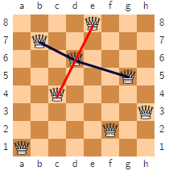
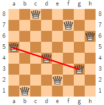
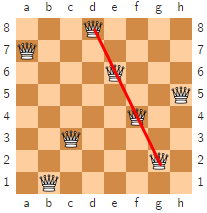

# Problem statement

You are given the code for the n-queens problem [here](https://github.com/bogdansalau/dsa-2021-g3/blob/master/Code/DSALab11_code.txt).

Write an algorithm, together with your teammates, that counts how many solutions to this problem has **4 collinear queens**.

Two queens are collinear when they are on the same line (obviously).

You can also use a pen-and-paper approach. For the solution to be valid, you must show me all the possible combinations.

Examples:

Red line - collinear, the queens form a line :white_check_mark: 

Black line - not collinear :no_entry:

